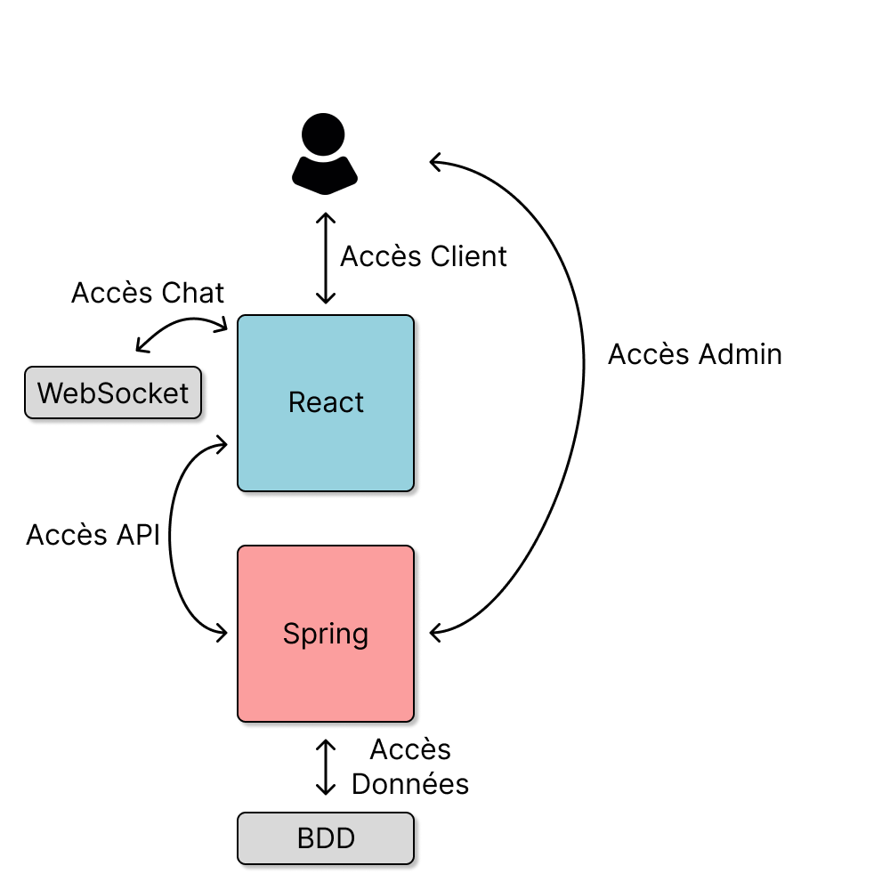
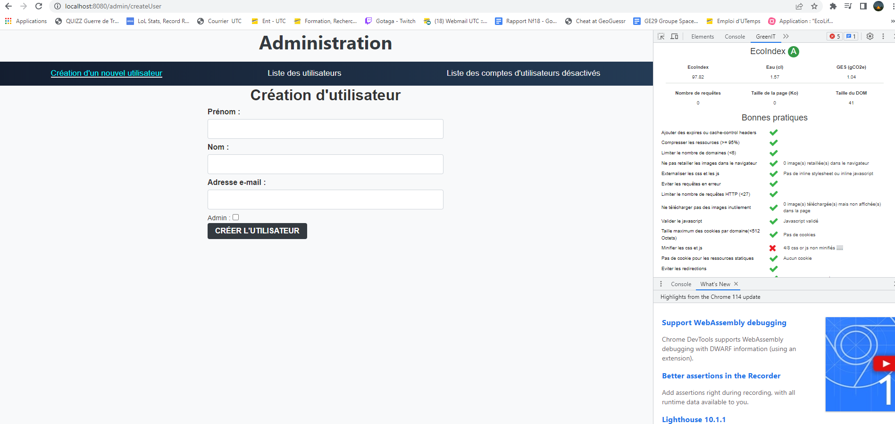
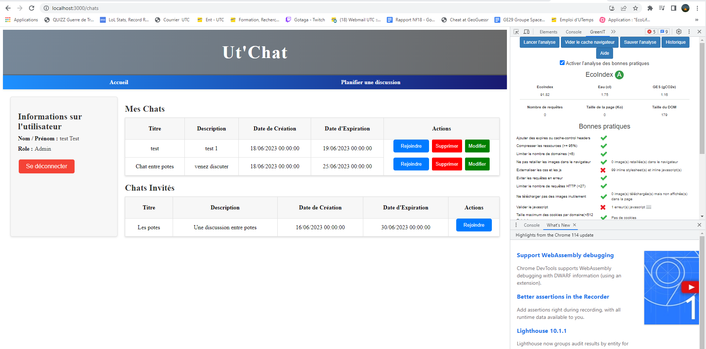

# Mointermost
### Florestan BIAUX - Dimitry Rudenko

## Architecture de l'application
<br>

<br>

Notre application est composée d'une base de données MySQL qui permet de conserver les données de façon permanente entre les utilisations de l'application.
De plus, nous disposons aussi d'un serveur Spring qui permet d'accéder à l'interface d'administration de l'application.
Ce serveur héberge aussi un serveur API qui permet aux clients d'accèder aux données stockées dans la base de données.
En outre, l'application est aussi composée d'une partie frontend en React qui permet aux clients de se connecter et d'accéder à l'application.
Enfin, la dernière partie de l'application est un module WebSocket qui permet d'ouvrir et de se connecter aux chats.

Cette architecture s'approche du module MVC (Model View Controller), où la partie React est la vue, Spring est le contrôleur et la base de données le modèle (de données). 

## Interactions entre les différentes technologies
### Connexion à l'espace client
```plantuml
actor Utilisateur

participant React
participant Spring
participant WebSocket
participant BDD

activate Spring
activate BDD

Utilisateur --> React : Accès à l'espace utilisateur
activate React
React --> Spring : Requête API
Spring --> BDD : Requête dans la base de données
BDD --> Spring : Retour d'informations
Spring --> React : Retour de requête
React --> Utilisateur : Affichage du site web.
```

### Connexion à l'espace admin
```plantuml
actor Utilisateur

participant React
participant Spring
participant WebSocket
participant BDD

activate Spring
activate BDD

Utilisateur --> Spring : Accès à l'espace admin
Spring --> BDD : Requête dans la base de données
BDD --> Spring : Retour d'informations
Spring --> Utilisateur : Affichage du site web.
```

### Connexion à un chat
```plantuml
actor Utilisateur

participant React
participant Spring
participant WebSocket
participant BDD

activate Spring
activate BDD

Utilisateur --> React : Accès à l'espace utilisateur
activate React
React --> Spring : Requête API
Spring --> BDD : Requête dans la base de données
BDD --> Spring : Retour d'informations
Spring --> React : Retour de requête
React --> Utilisateur : Affichage du site web
Utilisateur --> React : Accès à un chat
React --> Spring : Accès à la room
Spring --> WebSocket : Accès à la room
activate WebSocket
WebSocket --> Spring : Retour de la room
Spring --> React : Retour de la room
React --> Utilisateur : Affichage de la room.
```
Les exemples ci-dessus illustrent l'ordre des interactions entre les différents composants de l'application dans différents cas d'usage, si l'utilisateur se connecte directement à l'interface administrateur, l'application sera uniquement gérée par spring qui intéragira directement avec la BDD.
Si le client passe par l'interface utilisateur, ce sera React qui s'occupera de l'application en interagissant avec Spring via son API et les websockets pour créer les chats.

## Conception

### UML
```plantuml
abstract class User{
    {field} String firstName
    {field} String lastName
    {field} String mail
    {field} String password
    {field} boolean isActive
    {field} boolean isAdmin
    {field} List<Chat> invitedChat
    {field} List<Chat> createdChat
    
    {method} void createChat()
    {method} void modifyChat()
    {method} void deleteChat()
    {method} void joinChat()
    {method} void sendMessage()
}
class Admin{
    {field} boolean isAdmin = true
    
    {method} void createUser()
    {method} void deleteUser()
    {method} void getInactiveUsers()
    {method} void deleteChat()
}
class NormalUser{
    {field} boolean isAdmin = false
}

User <|--Admin
User <|--NormalUser

class Chat {
    {field} Long id
    {field} String title
    {field} String description
    {field} LocalTime creationDate
    {field} LocalTime expirationDate
    {field} User creator
    {field} List<User> members
}

Chat "0..*" <--> "2..*" User
Chat "*" <--> "1" User
```

Lors de la conception de l'application, nous avons réfléchi a la façon de mettre en place les 2 types d'utilisateurs avec leurs spécificités. Le plus simple pour cela a été de mettre en place de l'héritage.
Cependant, lors de la mise en place avec JPA, nous avons remarqué qu'il créait lui-même une unique classe User dans la base de données pour stocker les 2 différents types avec uniquement le paramètre "isAdmin" comme caractère de différenciation.
Cet héritage n'est donc plus par classe abstraite mais avec un héritage par classe mère.


## Éco-responsabilité et notre utilisation de GreenIT

Comme beaucoup d'entreprises à travers le monde, nous sommes de plus en plus conscients de l'importance de prendre des mesures pour réduire notre impact environnemental. Pour nous, cela commence par comprendre l'empreinte carbone de notre site web.

C'est pourquoi nous avons décidé d'utiliser [GreenIT](https://www.greenit.fr/), un outil qui analyse la performance de notre site en termes d'éco-conception web. GreenIT fournit un rapport détaillé sur plusieurs aspects de notre site, y compris le poids des pages, l'optimisation du code et l'efficacité du serveur.

L'objectif de l'utilisation de GreenIT est de nous aider à comprendre où nous en sommes actuellement en termes d'impact environnemental et de nous aider à identifier les domaines où nous pourrions améliorer. Cela peut impliquer l'optimisation de notre code, la réduction de la taille des données que nous transférons, ou l'amélioration de l'efficacité de notre serveur - chaque petite amélioration compte.

En fin de compte, nous espérons que notre engagement à utiliser GreenIT et à optimiser notre site pour réduire son empreinte carbone montrera que nous prenons nos responsabilités environnementales au sérieux. Nous croyons fermement que chaque pas que nous faisons vers un avenir numérique plus durable est un pas dans la bonne direction.

Voici les résultats pour la page admin:
<br>

<br>
Et les résultats pour la page utilisateur:
<br>


Les interfaces administrateur et utilisateur ont toutes deux obtenu le score "A" sur GreenIT, démontrant ainsi une bonne qualité en termes d'éco-responsabilité.